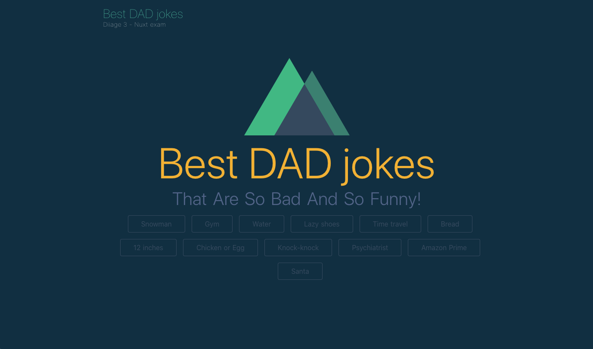

# Best DAD jokes

**Sujet** : Créer un site server-side rendered, pour mettre en avant les meilleures Joke de Papa.



# Préparation de l'environnement de dev (10 minutes)
- **Forker** le repository Github du front end : https://github.com/bratosab/v-best-dad-jokes vers votre compte Github
- **Cloner** votre repo en local sur votre poste pour travailler dessus
- **Installer** les dépendances `npm` et **lancer** le projet (Infos projet à la fin du readme)
- **Cloner** le repository Github du back end : https://github.com/bratosab/api-best-dad-jokes
- **Installer** les dépendances `npm` et **lancer** le projet (Voir readme du projet API)

# Partie 1 - Brancher une API (30 minutes)

- Les données utilisées par l'application sont actuellement directement le store: `/store/posts.js`, on souhaites les récuperer dynamiquement de l'API: 
  1. Ajouter un plugin permettant de faire des appels http au projet
  2. Ajouter une action permettant de faire l'appel GET pour récuperer les données
  3. Commiter les données de venant de l'API dans le state pour ne plus avoir les données en *dure*
  4. L'action doit charger le store dès que l'appli est chargée, peut importe la route demandée.
-  **Comiter** votre code avec le commentaire `feat(partie 1): Connecting to API` puis pusher votre code.

# Partie 2 - Server side rendering (15 minutes)

- Le projet tourne actuellement en mode SPA (server side rendering désactivé) : 
  1. **Activer** le server side rendering.
  2. Verifiez que la partie server compile en même temps que la partie cliente.
  3. Faire en sorte que les données soit chargé **côté serveur** si ce n'est pas encore le cas : au premier chargement de l'appli, aucun appel HTTP XHR vers l'API de récupération des données ne doit être visible dans mon navigateur.
- **Comiter** votre code avec le commentaire `feat(partie 2): SSR`
# Partie 3 - SEO et metas (15 minutes)

- La route pour visualiser un post est actuellement de la forme `/posts/_id`, changer se fonctionnement pour utilisé la propriété `slug` à la place de l'ID technique des entités Post, pour avoir une route ressemblant à `/posts/chickenegg` par exemple.
- La page index contiens des metas tag pour le titre de la page ainsi que pour un partage sur Twitter, faire pareil pour la page d'un post. Le contenu des metas doit être dynamique et correspondre au contenu affiché.
- **Comiter** votre code avec le commentaire `feat(partie 3): SEO`


# Pour finir (1 minute)

- Vérifier que votre code est bien **PUSHER** sur Github pour qu'il soit visible
- Envoyer le lien du repo ou votre username Github à @Abdallah et @Gaultier

# Les liens

- Code Front : https://github.com/bratosab/v-best-dad-jokes
- Code API : https://github.com/bratosab/api-best-dad-jokes 
- Swagger api : http://localhost:3001/explorer/

# Infos :

Le back-end est disponible sur internet, mais vous pouvez l'hoster chez vous si vous le souhaiter.

## Vous avez 1h30, bon courage !

---
# Informations supplémentaires : projet Nuxt
## Build Setup

``` bash
# install dependencies
$ npm run install

# serve with hot reload at localhost:3000
$ npm run dev

# build for production and launch server
$ npm run build
$ npm run start

```

For detailed explanation on how things work, check out [Nuxt.js docs](https://nuxtjs.org).
